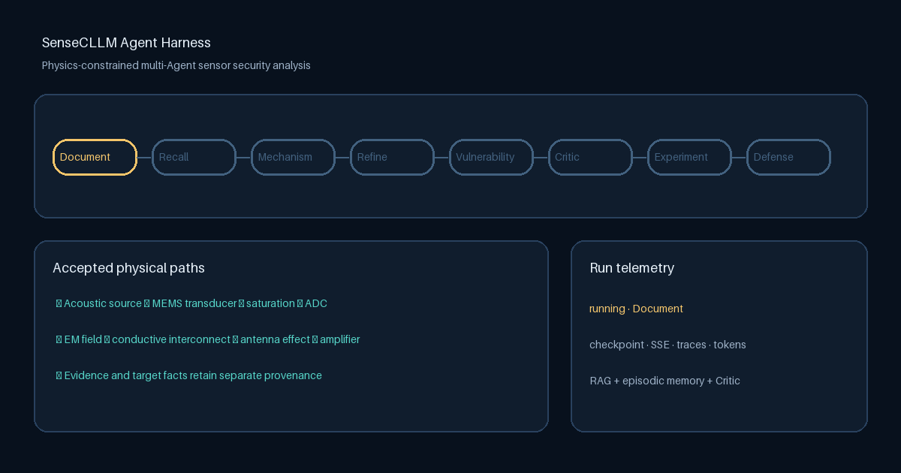

# SenseCLLM Harness

Physics-constrained multi-agent harness for sensor and cyber-physical security
analysis. It wraps the existing SenseCLLM mechanism graph, constraint reasoning,
and RAG pipeline with resumable Agent execution and historical case memory.



## What is implemented

- Five unchanged domain stages plus Case Recall/Refinement and independent Critic Agents
- Supervisor with typed run/stage state
- JSON checkpoints, resume, and JSONL lifecycle events
- Subprocess isolation and per-Agent stdout/stderr logs
- SQLite Episodic Memory for devices, paths, vulnerabilities, experiments, and
  physical verification outcomes
- Conditional ChatAnywhere DeepSeek review with revise/reject/human routing
- Evidence-backed report chat and verification-aware episodic ranking
- CLI, FastAPI/SSE, browser dashboard, run comparison, metrics, and traces
- Environment-only secret configuration

See [docs/architecture.md](docs/architecture.md) for the design and roadmap.

## Setup

```bash
python -m venv .venv
source .venv/bin/activate
pip install -e '.[api,legacy,rag,dev]'
cp .env.example .env
```

Export the required variables from `.env` with your preferred environment
loader, then start the existing RAG service:

```bash
python -m sensor_rag serve
```

The default Harness model is `deepseek-v3.2`. Configure it without committing
the key:

```bash
export CHATANYWHERE_API_KEY='your-key'
export SENSECLLM_MODEL='deepseek-v3.2'
export SENSECLLM_CRITIC_MODEL='deepseek-v3.2'
```

Run an analysis:

```bash
sensecllm analyze /absolute/path/to/datasheet.pdf --model deepseek-v3.2

# reproducible Agent ablations
sensecllm analyze examples/demo_sensor.md --profile single_agent
sensecllm analyze examples/demo_sensor.md --profile no_memory
sensecllm analyze examples/demo_sensor.md --profile no_critic
```

Resume an interrupted run:

```bash
sensecllm resume runs/<run-id>/checkpoint.json
sensecllm recover-stale --older-than-seconds 300
```

Search historical cases and record a physical verification outcome:

```bash
sensecllm memory-search microphone --mechanism nonlinearity
sensecllm record-verification <case-id> "Ultrasonic command injection" confirmed
```

Optional API:

```bash
uvicorn sensecllm.api.app:app --reload
```

Open `http://127.0.0.1:8000/` for upload, live Agent status, mechanism paths,
memory feedback, grounded report chat, and run comparison.

Useful endpoints:

- `POST /v1/runs` — start an analysis
- `GET /v1/runs/{run_id}` — inspect checkpointed state
- `GET /v1/runs/{run_id}/events` — stream lifecycle events over SSE
- `POST /v1/runs/{run_id}/cancel` — terminate a running Agent subprocess
- `POST /v1/runs/{run_id}/decision` — approve, revise, or reject a gated run
- `POST /v1/runs/{run_id}/chat` — ask a citation-constrained report question
- `GET /v1/runs/{run_id}/artifacts/{name}` — download an output or Agent log
- `GET /v1/memory/cases` — search episodic device cases
- `POST /v1/memory/cases/{case_id}/verification` — record a physical result
- `GET /metrics` — Prometheus-compatible local metrics

The complete remaining implementation plan is in [TODO.md](TODO.md).

## Docker demo foundation

After exporting fresh provider keys, build and start the API and the existing
RAG service:

```bash
docker compose up --build
```

The included `examples/demo_sensor.md` is fictional and redistributable. Start
an analysis from the host with:

```bash
curl -X POST http://127.0.0.1:8000/v1/runs \
  -H 'Content-Type: application/json' \
  -d '{"input_path":"/app/examples/demo_sensor.md","model":"deepseek-v3.2"}'
```

The RAG index must be built before its first complete retrieval run. The Docker
volume preserves the resulting `.rag_index` between restarts.

## Security note

The retained source uses only the credentials it needs, supplied through
environment variables. Unused legacy key fields were removed. Any credential
that was previously committed or shared should still be rotated by its owner.
See [the threat model](docs/threat-model.md) before exposing the local demo API.
