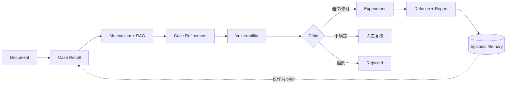

# SenseCLLM Harness 架构

## 项目定位

SenseCLLM Harness 是用于分析传感器与信息物理系统安全风险的物理约束多 Agent 系统。
它将机理图搜索、Dify 兼容的本地 RAG 服务、Episodic Memory 和可恢复 Agent
runtime 组合成统一架构。

## 运行流程

1. `DocumentAgent` 抽取目标设备事实和来源证据。
2. `CaseRecallAgent` 召回相似历史案例，并明确将其作为非证据性 prior。
3. `MechanismAgent` 使用论文 RAG client 和物理约束图搜索。
4. `VulnerabilityAgent` 将 accepted path 转换为有依据的漏洞假设。
5. `CriticAgent` 检查路径一致性，并在需要时升级给 DeepSeek 复核。
6. `ExperimentAgent` 从路径约束中推导物理验证参数。
7. `DefenseAgent` 将防御措施关联到具体 graph edge。
8. Supervisor 持久化 run artifacts、events、checkpoints 和 Episodic Memory。

依赖图采用确定性控制流，每个领域阶段消费前序阶段的 artifacts。Critic 先执行
deterministic check，只在需要时调用 ChatAnywhere DeepSeek，随后规范化修订后的
schema，并路由到 approve、revise、reject 或 human review。

每个领域阶段都在独立 subprocess 中运行。这样可以隔离 module-level runtime state，
保证并发 API run 之间互不污染，并将领域计算与 Harness supervision 分开。

## Memory

Memory 与论文 RAG 被有意分开：

- **Working Memory：** 可序列化的 `RunState`、JSON checkpoint 和 JSONL event stream。
- **Episodic Memory：** 使用 SQLite 保存历史设备、已发现机理、漏洞、实验方案和
  人工记录的验证结果。
- **Conversation Memory：** 保存 per-run user/assistant message 和 artifact citation；
  默认与机理推理隔离。

Episodic record 可按设备型号、传感器类型、机理、漏洞和验证状态检索。历史案例始终
只是 prior，不能作为目标设备证据。

## RAG

论文 RAG 是系统中唯一的文献检索实现。Harness 负责配置、健康检查、trace 和
provenance；RAG service 负责索引、hybrid retrieval、reranking 和 evidence packing。

## Runtime 与可观测性

每个 run 都有一个 correlation ID，由 checkpoint、event、log、JSONL trace span、
模型 usage record 和 artifact 共同使用。API 在 `/v1/metrics` 输出 JSON 聚合指标，
在 `/metrics` 输出 Prometheus 文本。由于 gateway 价格可能变化，模型单价通过配置提供。

根路径 `/` 的 dashboard 支持文件上传、实时 Agent 状态、path/artifact 查看、案例浏览、
物理验证反馈、run comparison 和 grounded report chat。

## 实施清单

完整实施清单维护在 [`TODO.md`](../TODO.md)。所有 benchmark 结论必须由不可变的专家
标签支持；smoke-test 结果与研究级评测分开报告。
