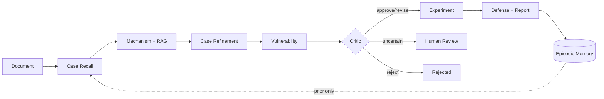

# SenseCLLM Harness architecture

## Positioning

SenseCLLM Harness is a physics-constrained multi-agent system for analysing
sensor and cyber-physical security risks. The existing mechanism graph search
and Dify-compatible/local RAG remain unchanged. The refactor adds an agent
runtime around those domain components.

## Runtime flow

1. `DocumentAgent` extracts target-device facts and source evidence.
2. `CaseRecallAgent` retrieves similar episodes as explicitly non-evidentiary priors.
3. `MechanismAgent` uses the existing RAG client and physics-constrained graph search.
4. `VulnerabilityAgent` turns accepted paths into grounded vulnerability hypotheses.
5. `CriticAgent` checks path consistency and conditionally escalates to DeepSeek.
6. `ExperimentAgent` derives physical verification parameters from path constraints.
7. `DefenseAgent` links mitigations to concrete graph edges.
8. The Supervisor persists run artifacts, events, checkpoints, and episodic memory.

The dependency graph is deterministic where a domain stage consumes the prior
stage's artifacts. The Critic performs deterministic checks first, calls a
ChatAnywhere DeepSeek model only when needed, normalises revised schemas, and
routes to approve, revise, reject, or human review.

Every unchanged legacy stage runs in a separate subprocess. This isolates the
legacy modules' global configuration and makes concurrent API runs safe while
preserving the existing core implementation.

## Memory

Memory is deliberately separated from the literature RAG:

- **Working memory:** one serialisable `RunState`, JSON checkpoints, and a JSONL event stream.
- **Episodic memory:** SQLite records for historical devices, discovered mechanisms,
  vulnerabilities, proposed experiments, and human-recorded verification outcomes.
- **Conversation memory:** per-run user/assistant messages plus artifact citations;
  it is isolated from mechanism reasoning by default.

Episodic records are retrieved by device model, sensor type, mechanism,
vulnerability, and verification status. Historical cases are priors, never
target-device evidence.

## RAG

The existing RAG remains the single literature retrieval implementation. The
Harness owns only its configuration, health checking, tracing, and provenance;
it does not duplicate indexing or retrieval algorithms.

## Runtime and observability

Each run has a correlation ID shared by checkpoints, events, logs, JSONL trace
spans, model-usage records, and artifacts. The API exports a JSON aggregate at
`/v1/metrics` and Prometheus text at `/metrics`. Pricing is deliberately
configuration-driven because gateway prices may change.

The dashboard at `/` supports upload, live Agent state, path/artifact inspection,
case browsing, physical verification feedback, run comparison, and grounded
report chat.

## Roadmap

The complete implementation checklist is maintained in [`TODO.md`](../TODO.md).
Benchmark claims remain gated on immutable expert labels; smoke-test results are
reported separately from research-quality evaluation.
