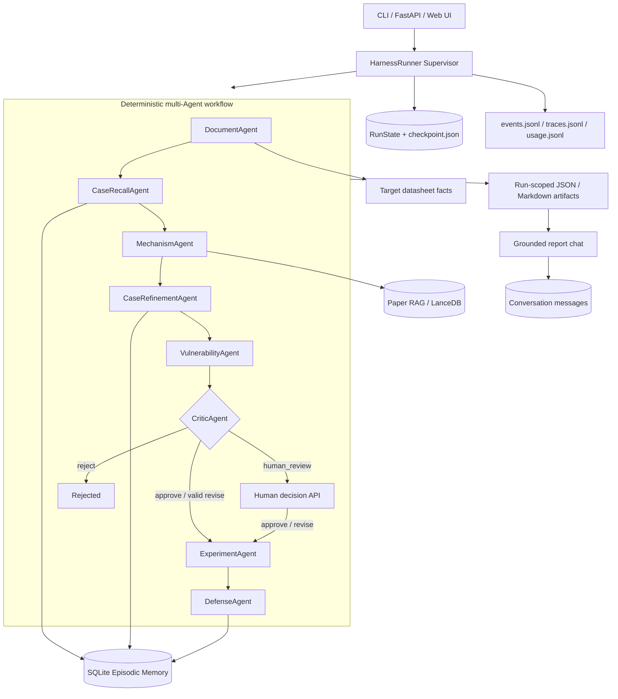
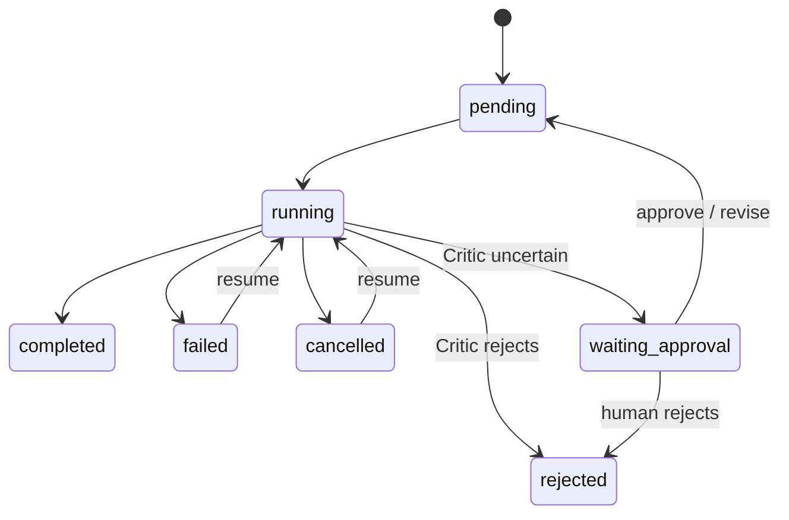

# SenseCLLM Harness 面试学习手册

> 目标：不只会演示项目，而是能够从代码、架构取舍、算法细节、可靠性和评测五个层面解释它。
>
> 适用岗位：大模型算法实习、LLM Application / Agent Engineer、RAG 算法、AI Infra 实习。
>
> 文档基于仓库 2026-08-25 的真实实现与实测结果；互联网趋势资料检索于 2026-08-25。
>
> **阅读重点：本文聚焦 Agent Harness 的实现。传感器安全只是任务载体，领域机理仅保留理解 Agent 输入输出所需的最小背景。**

---

## 0. 先记住这三句话

1. **SenseCLLM Harness 的核心贡献是 Agent runtime，而不是简单增加多个 Prompt**：它实现了 Agent contract、Supervisor、typed state、artifact handoff、checkpoint/resume、Memory、Critic/HITL、budget、trace 和 eval。
2. **控制流是确定性的 multi-Agent workflow，阶段内部包含 LLM-driven reasoning**：Supervisor 负责可预测的依赖和状态迁移，专业 Agent 负责有边界的推理，因此系统兼顾可控性与模型能力。
3. **Agent 间不共享无限对话，而是传递结构化状态和 artifacts**：每个 Agent 只获得完成职责所需的最小上下文，历史经验、外部证据和本次运行事实有独立 provenance。

这三句话分别回答：Harness 实现了什么、Agent 到底有多自主、Agent 如何协作。

---

## 1. 怎么学习这份文档

建议按下面顺序学习：

1. 先背熟第 2 节的 30 秒和 2 分钟介绍。
2. 对照第 3～8 节阅读代码，自己画一遍状态图和数据流图。
3. 启动一次 demo，按第 17 节追踪产物。
4. 用第 14 节面试题做口头模拟，每题控制在 1～2 分钟。
5. 最后读第 15 节，学会主动承认边界并给出生产化方案。

关键源码入口：

- Supervisor：[`src/sensecllm/harness/runner.py`](../src/sensecllm/harness/runner.py)
- Agent 装配：[Agent modules](../src/sensecllm/agents)
- 运行状态：[`src/sensecllm/harness/state.py`](../src/sensecllm/harness/state.py)
- Critic：[`src/sensecllm/agents/critic_agent.py`](../src/sensecllm/agents/critic_agent.py)
- Episodic Memory：[`src/sensecllm/memory/episodic.py`](../src/sensecllm/memory/episodic.py)
- 物理机理图搜索：[`src/steps-graph-v2/step2_graph/graph_searcher.py`](../src/steps-graph-v2/step2_graph/graph_searcher.py)
- RAG：[`sensor_rag/pipeline.py`](../sensor_rag/pipeline.py)

---

## 2. 面试开场话术

### 2.1 30 秒版本

> 我设计并实现了一个可恢复的 multi-Agent Harness。系统通过统一的 `BaseAgent` contract 和 `AgentContext` 组织 8 个专业 Agent，由 Supervisor 管理依赖、状态迁移、重试、取消、预算和 checkpoint；Agent 之间通过 run-scoped artifacts 传递结构化上下文。系统还包含三类 Memory、deterministic-first Critic、HITL、SSE、trace 和 Agent ablation。传感器安全是应用场景，项目重点是把多阶段 LLM 推理做成可恢复、可评测、可审计的 Agent runtime。

### 2.2 两分钟版本

> 整体分为三层。第一层是 Agent contract：所有 Agent 暴露 `name`、`depends_on` 和 `execute(context)`，`AgentContext` 统一注入 RunState、runtime、Memory 和 settings。这样领域 Agent、确定性 Memory Agent 和 Critic Agent 可以被同一个 Supervisor 调度，也可以在测试中替换 runtime 或 Memory。
>
> 第二层是 Harness runtime：Supervisor 维护 typed `RunState`/`StageRecord`，逐阶段检查 dependency、cancel 和 budget；执行前后原子保存 checkpoint，记录 event、trace、usage 和 artifact。每个领域 Agent 在独立 subprocess 中运行，所以并发 run 不共享 module-level state；transient/timeout 错误指数退避重试，失败或中断后以 stage-level at-least-once 语义恢复。
>
> 第三层是 Agent quality control：Working Memory 保存运行现场，Episodic Memory 召回带验证反馈的历史案例，Conversation Memory 隔离保存报告问答。Critic 先执行确定性 invariant checks，异常时才调用 DeepSeek，并路由到 approve、revise、reject 或 human review。最后通过 single-agent、no-memory、no-Critic 等 profile 和 trajectory metrics 评测 Harness 各组件是否真正有价值。

### 2.3 STAR 版本

- **Situation**：传感器安全分析同时涉及非结构化文档、论文证据、物理约束和多阶段推理，需要解决并发隔离、失败恢复、证据可信度与可评测性问题。
- **Task**：设计一个既保留领域推理深度，又具备可靠运行时、Memory、质量控制和演示能力的 Agent Harness。
- **Action**：实现 Agent 边界、Supervisor、subprocess isolation、typed checkpoint、Memory、Critic/HITL、observability、API/UI 和 benchmark schema。
- **Result**：真实 DeepSeek E2E smoke run 用时 320.975 秒、12 次模型调用、127,123 accounted tokens；RAG 索引 20 篇 PDF、745 chunks、0 indexing failures。注意这些是工程验证，不是泛化准确率声明。

---

## 3. 概念定位：Workflow、Agent、Multi-Agent 与 Harness

### 3.1 四个概念

| 概念 | 含义 | 本项目对应物 |
|---|---|---|
| Workflow | 控制流由代码预定义 | 8 个阶段的依赖顺序 |
| Agent | 模型根据上下文进行推理、选择候选或行动 | 文档抽取、机理候选生成、漏洞分析、Critic LLM review |
| Multi-Agent | 多个隔离的角色/上下文协同完成任务 | 专业阶段 Agent + 独立 Critic + Memory Agent |
| Agent Harness | 让模型可以稳定执行任务的运行时脚手架 | Supervisor、state、tool/runtime、checkpoint、budget、trace、eval |

Anthropic 对 workflow 和 agent 的严格区分是：workflow 的路径由代码预定义，agent 则由 LLM 动态决定过程。按这个定义，本项目是 **deterministic multi-Agent workflow with agentic reasoning inside stages**，而不是开放式 autonomous agent。这个回答比简单说“我做了 8 个 Agent”更可信。

### 3.2 为什么仍然有资格叫 Agent Harness

Harness 并不要求控制流全部由 LLM 决定。它解决的是：

- 给模型什么上下文、工具和边界；
- 如何组织多步执行；
- 如何保存状态并从失败恢复；
- 如何限制成本和危险行为；
- 如何记录 trajectory 并评测最终 outcome。

本项目在这些方面都有明确实现。Anthropic 2026 年的定义也把 Agent Harness 描述为“处理输入、编排工具调用并返回结果的系统”，并强调评测时实际测的是 model + harness 的组合。

### 3.3 为什么没有使用 LangGraph

这不是“重复造轮子”，而是一个项目选择：

- 自研状态机使 checkpoint、重试、预算、HITL 和 subprocess 语义完全显式，面试时可以讲清底层机制；
- 领域阶段使用 run-scoped artifacts 和部分 module-level runtime state，process boundary 比框架 graph node 更直接地提供并发隔离；
- 当前 DAG 小且稳定，自研实现的复杂度可控；
- 代价是缺少成熟框架的 distributed persistence、可视化调试和生态集成。

如果生产规模扩大，可以把 Agent 节点迁移到 LangGraph，但 subprocess adapter、领域 artifacts 和 Memory schema 仍可复用。

---

## 4. 总体系统架构



### 4.1 分层理解

系统可拆成五层：

1. **Interface Layer**：CLI、FastAPI、SSE、Web dashboard。
2. **Harness Runtime Layer**：Supervisor、RunState、checkpoint、failure policy、budget。
3. **Agent Layer**：8 个专业 Agent 和 single-agent baseline。
4. **Domain Layer**：五阶段领域 pipeline、physics-constrained graph search、RAG。
5. **Data/Observability Layer**：run artifacts、SQLite、events、traces、usage、metrics。

### 4.2 一次运行的数据目录

```text
runs/<run_id>/
├── checkpoint.json          # 可恢复的权威运行状态
├── events.jsonl             # run/agent 生命周期事件，SSE 数据源
├── traces.jsonl             # 每个 stage 的 span
├── usage.jsonl              # 每次模型调用的 token/cost
├── report.md                # 最终报告
├── logs/<stage>.log         # subprocess stdout + stderr
└── temp_data/report/
    ├── step1_output.json
    ├── episodic_case_recall.json
    ├── step2_mechanism_paths.json
    ├── episodic_case_refinement.json
    ├── step3_vulnerability_items.json
    ├── critic_review.json
    ├── step4_single_results.json
    └── ...
```

这里采用 **artifact-based handoff**：Agent 间不是共享无限对话，而是传递结构化 JSON 文件和有限 metadata。优点是可检查、可恢复、可重放，也降低长上下文污染。

---

## 5. Supervisor：Harness 的核心

核心类是 `HarnessRunner`。理解它要抓住 create、execute、stage attempt、resume 四条路径。

### 5.1 创建运行

`create_run()` 做了五件事：

1. 解析并验证 input path；
2. 生成 UUID `run_id` 和隔离的 `run_dir`；
3. 按 Agent 列表创建 `StageRecord`；
4. 把 profile、RAG/constraint/Critic 开关和预算写进 metadata；
5. 先保存 checkpoint，再发出 `run.created`。

先持久化再执行很重要：即使进程在第一个 Agent 前崩溃，运行仍然可发现。

### 5.2 RunState 与 StageRecord

`RunState` 保存：运行 ID、输入、模型、全局状态、当前 stage、所有 stage record、artifacts、metadata 和 error。

`StageRecord` 保存：stage 状态、开始/结束时间、attempts、failure class、error 和 output preview。



### 5.3 主执行循环

`execute()` 的逻辑可以记成伪代码：

```python
state.status = RUNNING
for agent in agents:
    check_run_budget()
    check_cancel_file()
    if agent already completed:
        continue
    ensure_dependencies_completed()
    execute_agent_with_retry(agent)
    if critic rejects:
        return REJECTED
    if critic requests human:
        return WAITING_APPROVAL

state.status = COMPLETED
discover_artifacts()
episodic_memory.remember_run(state)
save_checkpoint()
```

这不是简单的 `for` 循环，因为每一步前后都存在 durable state、event、trace、budget 和条件路由。

### 5.4 Retry 与 Failure Classification

异常被分成：

- `cancelled`：用户主动取消；
- `budget`：时间、attempt、token 或 cost 超限；
- `timeout`：单 Agent 超时；
- `transient`：HTTP 408/429/5xx、连接重置、临时不可用；
- `permanent`：schema、代码、输入等确定性错误。

只有 `transient` 和 `timeout` 自动重试，delay 为：

```text
delay = retry_backoff_seconds × 2^(attempts - 1)
```

为什么不能所有错误都重试？因为 permanent error 重试只会烧 token、增加延迟，还可能掩盖数据契约错误。

### 5.5 Checkpoint 与 Resume

Checkpoint 采用 `tmp file -> replace`：先写 `checkpoint.json.tmp`，再原子替换正式文件，减少中途 crash 导致半个 JSON 的概率。

`resume()` 会：

- 直接返回已完成运行；
- 将 `running/failed/cancelled` stage 重置为 `pending`；
- 保留已经 `completed` 的 stage；
- 清理 cancel marker；
- 从第一个未完成 stage 继续。

当前语义是 **stage-level at-least-once execution**，不是 exactly-once。某个 stage 在“写业务 artifact 成功但 checkpoint 前崩溃”时可能重跑。因此 stage 最好是幂等的，或把 artifact 写入 run-scoped path 后原子提交。

### 5.6 Cancel、Timeout 与 Stale Recovery

- Cancel 使用 run 目录中的 `cancel.requested` 文件，Supervisor 和 subprocess polling loop 都检查它。
- subprocess 超时后先 `terminate()`，5 秒未退出再 `kill()`。
- API 服务重启后，`recover_stale_runs()` 把长时间停留在 `RUNNING` 的 checkpoint 标记为 transient failure，之后可显式 resume。

### 5.7 Budget

当前支持：run timeout、Agent timeout、单 Agent attempts、全运行 attempts、model tokens 和配置单价后的 estimated cost 上限。

预算是 Agent 系统的 safety boundary：它防止模型循环、provider retry storm 和不可控费用。

---

## 6. 为什么要用 subprocess isolation

领域 pipeline 的各阶段会使用 module-level configuration、临时 artifacts 和动态 `PYTHONPATH`。如果让多个 run 在同一个 Python process 中直接执行，可能出现全局路径互相影响、临时文件覆盖、import/cache 状态交叉，以及无法可靠终止的问题。

运行时适配器为每个领域 stage 启动独立 worker process，并以命令行参数传入 stage、project root、input、report 和 model。worker 只负责执行当前 stage，Supervisor 负责生命周期、状态和错误处理。

并注入 run-scoped usage file 和 trace ID，把 stdout/stderr 合并写入独立 log。

优点是 process-level fault/config isolation、可 terminate/kill，并且让领域计算与 Harness supervision 保持清晰边界；代价是进程启动开销、文件 schema 管理，以及仍然只适合单机。生产化可以换成 Celery/RQ/Kubernetes Jobs，但保持 `run_stage(stage, model)` adapter 接口。

---

## 7. Agent 实现详解

### 7.1 Agent 装配与依赖

Agent factory 在 `profile="full"` 时生成：

```text
document -> case_recall -> mechanism -> case_refinement
         -> vulnerability -> critic -> experiment -> defense
```

`BaseAgent` 刻意保持最小接口：

```python
class BaseAgent(ABC):
    name: str
    depends_on: tuple[str, ...] = ()

    @abstractmethod
    def execute(self, context: AgentContext) -> Any:
        ...
```

`AgentContext` 是 Harness 与 Agent 之间的 dependency-injection boundary：

```python
@dataclass
class AgentContext:
    state: RunState       # 本次运行的 working memory
    runtime: Any          # 领域工具执行适配器
    memory: Any           # episodic/conversation store
    settings: Any         # timeout、model、budget 等配置
```

最小 contract 的好处是：

- Supervisor 不需要知道 Agent 内部是 LLM、SQL、规则还是 subprocess；
- Agent 可以通过 `depends_on` 声明前置条件；
- 测试可注入 fake runtime/fake memory，不需要真实 provider；
- 新 Agent 只需实现 `execute()`，无需修改 Supervisor 主循环；
- orchestration concern 与 domain reasoning concern 分离。

当前 Agent 可以按执行方式分成三类：

| 类型 | Agent | 实现方式 | Harness 关注点 |
|---|---|---|---|
| LLM/domain Agent | Document、Mechanism、Vulnerability、Experiment、Defense | 通过 runtime 调用独立 stage worker | isolation、timeout、artifact contract |
| Deterministic Memory Agent | CaseRecall、CaseRefinement | Python + SQLite | retrieval policy、provenance、ranking |
| Hybrid Critic Agent | Critic | deterministic checks + conditional LLM | decision routing、fail-closed、HITL |

一个 Agent attempt 的统一生命周期为：

```text
dependency check
  -> mark RUNNING + checkpoint + agent.started
  -> budget check + attempts += 1
  -> execute(AgentContext)
  -> COMPLETED + trace + usage + checkpoint + agent.completed
  -> transient/timeout ? backoff retry : FAILED
```

Profile 包括 `full`、`no_memory`、`no_critic` 和 `single_agent`，用于可重复消融。

### 7.2 DocumentAgent：入口 Agent

| 项目 | 内容 |
|---|---|
| Agent 执行层 | Document stage adapter |
| 领域实现 | `step1_extract.run_step_1()` |
| 输入 | PDF/Markdown datasheet、model |
| 输出 | `step1_output.json`、sensor info、`rag_input` |
| 作用 | 抽取目标设备组件、参数、传感器类型与可追溯源信息 |

从 Agent 实现角度看，它负责把非结构化用户输入转换成下游稳定消费的 structured artifact。它体现的是 **input normalization Agent** 模式：下游 Agent 不再重复读取整份文档，而只读取抽取后的高信号状态。其主要风险是 JSON schema 漂移，因此当前通过结构化 artifact 和 alias fallback 做兼容；生产环境应增加 Pydantic validation 和字段级 provenance。

### 7.3 CaseRecallAgent：第一次 Memory Read

这是确定性 Agent，不调用 LLM。它读取 DocumentAgent artifact，构造 Memory query，搜索 SQLite、去重并取前 5，最后同时写 artifact 和 `state.metadata["similar_cases"]`。

它展示了一个重要观点：**Agent 不等于一次 LLM call**。只要组件拥有独立职责、上下文、输入输出 contract，并由 Harness 调度，它就可以是检索 Agent、规则 Agent 或工具 Agent。使用确定性实现还能节省 token 并提高可复现性。

### 7.4 MechanismAgent：Tool-Using Reasoning Agent

| 项目 | 内容 |
|---|---|
| Agent 执行层 | Mechanism stage adapter |
| 领域实现入口 | `step2_analyze.run_step_2()` |
| 输入 | Step1 sensor facts、论文 RAG memo、物理图/算子注册表 |
| 输出 | accepted/unresolved/rejected mechanism paths |
| 主要算法 | LLM candidate generation + physics-constrained graph search |

从 Agent 角度看，它不是“一次 Prompt”，而是一个 bounded reasoning loop：

```text
retrieve evidence -> construct local context -> LLM proposes candidates
-> deterministic tool checks -> prune frontier -> repeat or stop
```

它体现了四个通用 Agent 设计：

- **LLM proposes, code disposes**：模型提出开放语义候选，确定性工具验证不变量；
- **bounded autonomy**：`max_depth`、beam width、最大调用数和 accepted-path limit 防止无限循环；
- **batched tool use**：一层 frontier 合并调用，避免每个 state 单独消耗一次模型请求；
- **explicit uncertainty**：结果分为 accepted、unresolved、rejected，而不是强迫模型二选一。

传感器图搜索只是该 Agent 的领域工具。面试重点应放在“如何把 LLM generation 包在受约束、可停止、可追踪的循环里”。

### 7.5 CaseRefinementAgent：第二次 Memory Read

MechanismAgent 完成后，它利用新增的中间结果进行第二阶段检索和重排。这是 **retrieve-refine** 模式：早期上下文不足时先做粗召回，获得更具体的运行状态后再精排，避免一开始就凭不完整信息做最终 Memory 选择。

```text
memory_score =
    2.0 × mechanism_overlap_count
  + 1.0 × component_overlap_count
  + 0.75 × confirmed_count
  - 0.75 × rejected_count
  - 0.10 × inconclusive_count
```

再以 `(memory_score, updated_at)` 降序取前 5，并写入 `similar_cases_ranked`。这是可解释 heuristic，不是学习得到的 ranker。对 Agent 系统而言，它提供了可审计的 context selection policy；未来有足够反馈后可用 learning-to-rank，但要防 exposure bias。

### 7.6 VulnerabilityAgent：Structured Generation Agent

| 项目 | 内容 |
|---|---|
| Agent 执行层 | Vulnerability stage adapter |
| 领域实现 | `step3_detect.run_step_3()` |
| 输入 | accepted mechanism paths、sensor facts |
| 输出 | `step3_vulnerability_items.json` |
| 作用 | 把物理可达路径转成漏洞假设和可利用条件 |

它把上游复杂 artifacts 转换成固定 schema，是典型的 **structured generation Agent**。它的关键不是领域结论本身，而是必须保留上游引用字段，使 Critic 能验证每个输出是否有合法来源。生成和审查由不同 Agent 承担，避免同一上下文中的 self-review bias。

### 7.7 CriticAgent：Evaluator 与 Router

Critic 采用 **deterministic-first, LLM-on-exception**。

本地规则从 accepted paths 构造 supported mechanisms 和 `(mechanism, component)` pairs，再检查是否有 accepted path、vulnerability item、mechanism/path 支持、component pair 一致性和有效 schema。

为了处理 schema 漂移，代码规范化大小写/符号，去掉 `effect`/`mechanism` 后缀，处理 component alias，并把 `mechanism/title/name/component/entry_point` 等别名转成 canonical schema。

deterministic review 通过就不调用模型；否则调用 DeepSeek 独立审查，返回 `approve | revise | reject | human_review`。若 revise，则：

1. 备份原 vulnerability 文件；
2. canonicalize 新 schema；
3. 写回 artifact；
4. **再次运行 deterministic review**；
5. 只有复检通过才 approve，否则转 human review。

模型调用失败也不会默认放行，而是 fail closed 到 human review。prompt version、rule version 和 model 都持久化，便于审计与实验复现。

### 7.8 ExperimentAgent：Plan Compiler Agent

| 项目 | 内容 |
|---|---|
| Agent 执行层 | Experiment stage adapter |
| 领域实现 | `step4_verify_per_vulnerability.run_step_4()` |
| 输入 | Critic 通过的漏洞、supporting path、参数约束 |
| 输出 | verification plans、constraint traces |
| 作用 | 将漏洞假设编译成可验证的实验参数范围 |

从 Agent 架构看，它把经过审查的 hypothesis 编译成结构化 action plan，并附带 constraints 和 provenance。它不直接执行高风险动作，而把方案交给人验证；验证结果通过 Memory write path 回流。这是“Agent proposes、human acts、Memory learns”的闭环。

### 7.9 DefenseAgent：Synthesis Agent

| 项目 | 内容 |
|---|---|
| Agent 执行层 | Defense stage adapter |
| 领域实现 | `step5_defense.run_step_5()` |
| 输入 | 漏洞、实验方案、物理路径 |
| 输出 | 防御建议与最终 report |
| 作用 | 将 mitigation 绑定到具体耦合路径或 graph edge |

它是主 DAG 的 synthesis Agent：读取多个上游 artifacts，生成面向用户的最终报告。完成后由 Supervisor 而不是 Agent 自己触发 artifact discovery 和 Episodic Memory write，避免业务 Agent 同时承担 orchestration side effects。

### 7.10 SingleAgentBaseline

它把五个领域阶段放在一个 Agent attempt 中顺序执行。它并不等于“只调用一次 LLM”，而是 orchestration boundary 变成一个大 Agent。因此比较结果只能说明不同 profile 的运行差异，不能直接证明多 Agent 一定提高准确率。

### 7.11 ReportChatService

它不属于主 DAG。它把本次 run 的 report 和 JSON artifacts 每 4000 字符切块，按 query term overlap 取前 6，要求模型只使用这些块，并校验返回的 `(source, chunk)` citation 必须在允许集合中。

这是轻量 run-artifact RAG，不是论文 RAG，也不是 Episodic Memory；适合 demo，但 lexical overlap 不适合大规模生产问答。

---

## 8. 三类 Memory：边界比复杂度更重要

### 8.1 Working Memory

内容是 `RunState`、`StageRecord`、checkpoint、events 和当前 run artifacts；生命周期为单次 run；目的是让 Supervisor 知道执行进度和恢复位置。

### 8.2 Episodic Memory

SQLite 中包括：

- `cases`：设备型号、sensor type、summary、source run；
- `findings`：mechanism path、vulnerability、experiment plan；
- `verification_results`：confirmed/rejected/inconclusive/not_tested、notes、evidence；
- `conversation_messages`：按 run 保存 chat 消息和 citations。

完整 run 后 `remember_run()` 将 artifacts 落库。人工实验通过 `record_verification()` 追加，下一次 CaseRefinement 将反馈纳入排名。

为什么用 SQLite：案例量小、过滤字段结构化、需要事务/审计/便携；当前瓶颈不是语义召回规模。规模扩大后可以加 embedding index，但 verification metadata 仍应在关系数据库。

### 8.3 Conversation Memory

Report chat 的消息按 `run_id` 保存，assistant 同时保存 validated citations。它默认不进入 MechanismAgent，避免用户对话污染物理推理。

### 8.4 Memory 与 RAG 的区别

| 维度 | Episodic Memory | Paper RAG |
|---|---|---|
| 来源 | 历史运行和人工实验反馈 | 外部论文语料 |
| 角色 | 经验 prior | 技术 evidence |
| 更新 | run 完成/人工验证后 | 离线 index |
| 检索 | SQL + heuristic rerank | dense + FTS + RRF + reranker |
| 风险 | 错误经验自我强化 | 检索错文、citation 不支持 claim |
| 防护 | 验证信号、non-evidentiary policy | provenance、阈值、held-out exclusion |

“类似设备被攻击过”不能证明“当前设备也能被攻击”，这是最重要的证据治理回答。

---

## 9. RAG 在 Agent 系统中的角色

### 9.1 RAG 是 Data Tool，不是另一个 Memory

RAG 由 MechanismAgent 作为外部 Data Tool 调用，负责把大规模论文语料压缩为带 provenance 的 evidence context。Agent 不直接持有整个索引，也不把 RAG 返回内容写成长期 Memory，这能保持检索服务、运行状态和历史经验三者解耦。

```text
sensor context -> retrieval query -> embedding
  -> vector cosine search ┐
                          ├-> weighted RRF fusion
  -> full-text search ────┘
  -> per-document diversity cap
  -> cross-encoder rerank
  -> threshold + top-k
  -> evidence pack with source/page
  -> grounded evidence memo
```

Hybrid fusion 使用：

```text
RRF(d) = Σ weight_r / (60 + rank_r(d))
```

向量权重 1.0，FTS 0.85；`strong_related_papers` 再乘 1.06。RRF 不依赖两个检索器原始 score 的量纲。之后 reranker 统一打分、过滤 threshold，并限制单篇论文 chunk 数，避免单一文档占满 context。

Hybrid retrieval 的 dense + FTS + RRF + reranker 属于工具内部实现。面试 Agent 岗时只需说明它为什么适合作为工具边界：输入是 query/context，输出是有限 evidence pack 和 sources，失败可以被 Harness 识别，结果可以被 trace 和 citation audit。

### 9.2 Tool Output 如何进入 Agent Context

RAG 输出先形成 evidence pack，再进入专业 Agent 的局部上下文。Prompt 要求逐 claim citation，区分 demonstrated evidence 与 hypothesis，证据不足就明确说明。这样 RAG 结果是模型可消费的数据，而不是能够覆盖 system instruction 的控制文本。

benchmark exclusion 被放在 service-wide boundary，而不是依赖每个 Agent caller 自觉执行。这体现了通用原则：安全和评测隔离规则应尽量下沉到工具接口，而不是只写在 Prompt 中。

### 9.3 Agent 为什么仍要关心 Retrieval Metrics

- `Recall@K`：相关文档有多少在前 K；
- `MRR`：第一个相关结果排名倒数；
- `NDCG@K`：考虑多级相关性和位置折损；
- 还应看 faithfulness、citation precision、latency 和 empty retrieval rate。

这些指标决定 Agent 得到的 context 上限；生成模型不能恢复从未召回的证据。当前 Recall@5=1.0、MRR=1.0、NDCG@5=0.8921 只来自 **one-query title-reviewed smoke audit**，不能说 RAG 准确率 100%。

---

## 10. Agent 间通信与 Context Engineering

本项目不共享无限增长的 conversation。每阶段读取所需 artifacts，输出新 artifacts；Critic 只截取最多 12 条 accepted paths、20 个 vulnerabilities、5 个 similar cases，并限制 prompt 长度。

### 10.1 为什么选择 Artifact Handoff

Agent 协作常见三种方式：

| 方式 | 优点 | 缺点 | 本项目选择 |
|---|---|---|---|
| 共享完整 message history | 实现简单、对话连续 | context 膨胀、耦合高、难恢复 | 不作为主 DAG 通信方式 |
| Agent 直接互相调用 | 动态性强 | 调用链隐式、易递归、难做统一 budget | 当前不采用 |
| Supervisor + structured artifacts | 可审计、可恢复、可单测 | schema 管理成本 | 主 DAG 使用 |

Artifact handoff 让每个 Agent 的输入输出形成可检查 contract。某个 Agent 出错时，可以只查看它读取和生成的文件；resume 时也无需重放此前所有 LLM conversation。

### 10.2 State、Metadata 与 Artifact 的职责

- `RunState`：控制面状态，例如 status、current stage、attempts；
- `metadata`：小型跨阶段索引，例如 similar case summaries、critic decision、usage；
- `artifact`：完整领域结果，例如 paths、vulnerabilities、review；
- `event/trace`：观测记录，不作为业务真值来源。

避免把大对象全塞进 `metadata`，也避免让下游靠解析 log 获取输入。控制面、数据面和观测面分离后，Agent contract 更稳定。

### 10.3 Context Selection

这是 context engineering：

- **选择**：只给所需 facts、paths、evidence；
- **压缩**：RAG memo、path summary、output preview；
- **隔离**：历史 case 和 report chat 不自动进入 target reasoning；
- **结构化**：JSON schema 替代大段自由对话；
- **预算**：限制 paths、items、tokens 和 calls。

上下文不是越多越好。长 context 会稀释注意力、增加成本，并扩大 prompt injection 与错误证据传播面。

---

## 11. 可靠性、安全与可观测性

### 11.1 Layered Guardrails

1. run/agent time、attempt、token、cost budget；
2. subprocess isolation 和 cancel；
3. RAG provenance 与 held-out exclusion；
4. physics graph type/evidence/constraint checks；
5. deterministic Critic；
6. LLM Critic exception review；
7. schema normalization + post-revision recheck；
8. human approval gate；
9. report chat citation allow-list。

### 11.2 Human-in-the-loop

Critic 不确定或 LLM review 失败时进入 `WAITING_APPROVAL`：approve 继续；reject 终止；revise 提交新 vulnerability schema 并重跑 Critic。人工是高不确定性/高风险结论的正式状态，不是随意兜底。

### 11.3 Observability

同一个 `run_id` 关联 checkpoint、events、logs、usage、traces、artifacts 和 episodic case。`TraceRecorder` 本地写 JSONL，可选 OTLP export；usage 按 provider/model 记录 tokens 和 configured estimated cost；API 暴露 JSON/Prometheus metrics。

- **log**：发生了什么文字信息；
- **metric**：可聚合数值；
- **trace**：一次 run 内 stage 因果链和耗时；
- **artifact**：Agent 的领域输出。

### 11.4 安全边界

- `.env` 自动加载但被 Git/Docker ignore；
- provider key 不写 checkpoint、log 或 source；
- secret scanner 覆盖源码和 stale bytecode；
- demo API 尚无 auth/RBAC/rate limit；
- PDF/RAG 文本属于不可信输入，生产还需 injection detection、sandboxed parser、MIME/size validation。

---

## 12. API 与产品层

核心接口包括创建/读取 run、SSE events、cancel、human decision、report chat、Memory search/verification 和 Prometheus metrics。

为什么用 SSE 而不是 WebSocket：当前主要是 server -> browser 的单向事件流，SSE 简单、浏览器原生重连、HTTP 语义清晰。审批/取消使用普通 POST。未来需要双向高频协作再考虑 WebSocket。

Web UI 支持上传、live Agent graph、path 状态、artifact/log、Memory feedback、报告问答和 run comparison，是演示层，不承载核心状态。

---

## 13. Evaluation：怎样证明不是“看起来能跑”

### 13.1 指标体系

| 层级 | 指标 |
|---|---|
| Orchestration | run completion、stage success、dependency violation、resume success |
| Reliability | retries、failure class、timeout、cancel latency、HITL rate |
| Context/Memory | context tokens、retrieval hit、citation validity、verified-case hit |
| Critic | approve/revise/reject 分布、false accept、false reject |
| Efficiency | duration、calls、tokens、configured cost、time per Agent |
| Domain outcome | extraction/label PR-F1、evidence support、constraint pass rate |
| RAG tool | Recall@K、MRR、NDCG@K、retrieval latency |

Agent Evaluation 同时看 Outcome 和 Trajectory。前者是最终结论/环境状态，后者是 calls、tokens、retries、tools、citations 和中间路径。

### 13.2 消融与结论边界

支持 multi vs single、RAG/no-RAG、constraints/no-constraints、Critic/no-Critic、full/no-memory。当前每配置只跑一次，存在 sampling 和 provider load 噪声，只能称 observed operational difference，不能称统计显著提升。

实测：Full run 320.975 s、12 calls、127,123 tokens、3 accepted paths；20 PDFs -> 745 chunks；pseudo-reference smoke 的 mean unsupported-claim rate 0.1266，vulnerability F1 只有 0.1667，低结果被保留。

真正可发表/上线还需要：独立专家 test set、多 trials 与 CI、retrieval/generation 分评、human calibration、capability/regression 分套件、failure slices 和 online shadow/physical validation。

---

## 14. 项目定制面试题与参考答案

回答时先说结论，再说项目证据，最后说边界。

### Q1：你的系统是真正的 Agent，还是普通流水线换了名字？

**答：** 控制层是确定性 workflow，阶段内部是 agentic reasoning。Supervisor 预定义依赖和 HITL 分支，所以不是开放式自主规划；但多个阶段使用模型基于上下文生成结构化决策，Harness 提供状态、工具、Memory、预算、恢复和评测。准确定位是 deterministic multi-Agent workflow / Agent Harness。

**追问：怎样更 autonomous？** 增加 bounded planner/router，让模型动态选择 mechanism tools、追加检索或验证，同时保留 max steps、tool allow-list 和 human gate。高风险任务未必越自治越好。

### Q2：为什么需要多 Agent？一个强模型不够吗？

**答：** 拆分解决 context specialization、artifact schema boundary、独立 Critic 的 self-review bias，以及 stage-level failure recovery。拆分价值必须用相同模型/输入/预算的多 trial ablation 证明；当前只有 operational observation。

### Q3：为什么 Agent 串行，没有并行？

**答：** 主 DAG 的阶段存在真实数据依赖，串行可以保证每个 Agent 获得完整上游 artifact。可并行的位置是同一阶段内的独立搜索分支、多个候选计划、RAG 的异构检索和多 judge。并行化前要处理共享 budget、结果归并、partial failure 和 cancellation propagation，并评测额外 token 是否值得。

### Q4：Supervisor 如何保证顺序？

**答：** Agent 声明 `depends_on`，执行前检查依赖 StageRecord COMPLETED；每次变化后 checkpoint/event；Critic 路由显式编码。

### Q5：进程挂掉怎样恢复？会不会重复？

**答：** completed stage 保留，running/failed/cancelled 重置 pending，语义是 stage-level at-least-once。业务写入需幂等或原子提交，不宣称 exactly-once。

### Q6：为什么不用数据库 checkpoint？

**答：** 单机 demo 用 JSON + atomic replace 可读、易调试。多 worker 生产应改成 Postgres versioned transaction、object storage 和 durable queue。

### Q7：如何避免并发污染？

**答：** UUID run directory + 每个领域阶段独立 subprocess + run-scoped input/report/usage/logs，module-level runtime state 只存在于对应子进程生命周期。

### Q8：Memory 存什么，如何召回？

**答：** Working Memory 管运行；Episodic 保存 device/mechanism/vulnerability/experiment/verification；Conversation 保存 per-run chat。先按 model/type SQL recall，再按当前 mechanism/component 和验证结果重排。

### Q9：如何防错误 Memory 自我强化？

**答：** case 只做 prior；confirmed/rejected 人工写回并影响排序；当前结论必须有 datasheet、论文与 accepted path 支持。生产再加 write gate、version、conflict、TTL 和 privacy policy。

### Q10：为什么 Memory 不用向量库？

**答：** 当前规模小且字段结构化，SQLite 的事务与审计更重要。规模扩大后可向量召回 + 结构 filter + verification-aware rerank。

### Q11：RAG 和 Memory 区别？

**答：** RAG 是外部论文 evidence，Memory 是历史经验 prior；写路径、可信度、召回算法和指标完全不同，不能混库后丢失 provenance。

### Q12：你怎样定义一个 Agent 的接口？

**答：** 当前最小 contract 是 `name + depends_on + execute(AgentContext)`。Context 注入 state、runtime、memory、settings，Agent 返回结果并写 run-scoped artifact。Supervisor 只依赖 contract，不关心内部是 LLM、SQL 还是规则。生产版可以进一步为 input/output 增加泛型和 Pydantic schema。

### Q13：Agent 之间如何通信？为什么不用共享完整对话？

**答：** 主 DAG 使用 Supervisor 管理的 structured artifact handoff，小型索引放 metadata。这样可审计、可恢复、可单测，并避免 context 随阶段无限增长。完整 conversation 只用于独立的 report chat，不污染主推理链。

### Q14：RunState、Memory 和 Context 有什么区别？

**答：** RunState 是控制面 working state；Memory 是可跨 run 检索的持久经验；Context 是某一次模型调用实际看到的有限 token 集。Harness 从 State、Memory、RAG 和 artifacts 中选择信息组装 Context，三者不能混为一个大对象。

### Q15：为什么使用确定性 workflow，而不是让 Planner 动态调度？

**答：** 当前任务阶段依赖稳定且结论风险较高，确定性 DAG 更易恢复、评测和审计。动态 Planner 适合步骤无法预知的开放任务，但会增加循环、预算和复现风险。未来可在局部增加 bounded planner，而不是把整个控制面交给模型。

### Q16：Agent 与 Tool 的边界是什么？

**答：** Tool 提供窄而确定的能力，例如检索、运行领域 stage 或查询 Memory；Agent 负责根据职责组织上下文、调用能力并产生决策或 artifact。当前 RAG/runtime/Memory store 是 tools，Mechanism/Critic/CaseRecall 是由 Supervisor 调度的 Agent。边界的核心是“能力执行”与“任务决策”分离。

### Q17：Critic 为什么不直接总是调用第二个模型？

**答：** membership/consistency 可确定性验证，更快、更便宜、可复现。仅异常时调用 DeepSeek，revision 后必须再过规则。这是 model-on-exception。

### Q18：Critic 也是 LLM，凭什么可靠？

**答：** 不假设它天然正确。可靠性来自角色/上下文隔离、rubric、只读 paths、结构 decision、版本、post-check 和 HITL；仍需专家数据校准 false accept/reject。

### Q19：模型 JSON 不合法怎么办？

**答：** 去 fence 后解析，要求顶层 object；字段 canonicalization；非法 decision 转 human review；失败 fail closed。生产可用 native structured output + Pydantic + constrained decoding。

### Q20：HITL 会不会失去自动化意义？

**答：** 只在高风险/不确定边界触发。deterministic approve 直接通过。用 review rate、false accept/reject 和 reviewer latency 优化阈值。

### Q21：怎么做 Agent Evaluation？

**答：** versioned tasks + multiple trials；代码 grader 评 schema/constraint/state，专家 labels 评领域质量，RAG 评排名，LLM judge 只处理开放文本且人工校准；同时记录 trajectory。

### Q22：LLM-as-a-Judge 有什么偏差？

**答：** position、verbosity、self-preference、prompt sensitivity、non-determinism。可 order swap、multi-judge、固定 rubric、reference evidence、低温和 human agreement 缓解。

### Q23：结果能证明多 Agent 更好吗？

**答：** 不能。single run、synthetic demo、pseudo-reference 只验证 plumbing。因果结论需要专家 test set、多 trials、CI 和控制变量。

### Q24：如何降低成本和延迟？

**答：** trace 定位热点；deterministic-first、batching、context selection、cache、按 Agent 做小模型 routing、并行独立任务、early stop 和 budgets。先有 eval baseline 再优化，避免用更低成本换来不可见的质量回退。

### Q25：不同 Agent 怎样选模型？

**答：** 强模型建立 baseline，再逐 Agent 替换。抽取、分类和格式转换可尝试小模型，复杂多步 reasoning 与关键 Critic 使用更强模型；比较 stage-level quality-latency-cost Pareto frontier，而不是所有 Agent 固定同一模型。

### Q26：SSE、trace、event、checkpoint 区别？

**答：** SSE 是传输；event 是生命周期事实；trace 是因果/耗时；checkpoint 是恢复权威状态。SSE 断开不影响执行。

### Q27：生产化怎么改？

**答：** API/worker 分离；Postgres state；Redis/queue；container sandbox；S3 artifacts；lease/idempotency；OTel backend；auth/RBAC/rate limit/tenant isolation/secrets manager；HITL review queue。

### Q28：如何防 Prompt Injection？

**答：** PDF/RAG 当不可信数据；system policy 与 data delimiter；工具最小权限与参数验证；输出/step 限制；高风险 HITL；异常 instruction detection；最终 deterministic constraints。当前 demo 没完整 classifier，是明确缺口。

### Q29：Report chat 为什么不塞完整报告？

**答：** 降低成本和 attention dilution。先 lexical retrieve 6 chunks，再 citation allow-list。未来可用 BM25/vector + artifact type/path ID filter。

### Q30：遇到过什么真实问题？

**答：** Critic revise 输出字段别名，语义正确但下游按 canonical schema 读取而失败。后来加入 schema normalization、原文件备份和 post-revision deterministic recheck，说明 Agent 间自然语言一致不等于接口一致，typed boundary 很关键。

---

## 15. 诚实边界与改进路线

- **不是动态 Planner**：顺序固定；未来可在 Mechanism 内加 bounded planner。
- **不是 8 个 LLM 并行自治**：主要是阶段/上下文隔离，Memory Agent 是确定性算法。
- **不是 exactly-once/distributed**：当前单机 subprocess + file checkpoint + at-least-once。
- **Memory ranker 是 heuristic**：尚未学习或标定。
- **Critic 不等于物理真值**：它主要检查 path linkage/schema；真实证据仍是专家与实验。
- **评测集不足**：synthetic/pseudo-label/single-query smoke 只能证明 plumbing。
- **API 安全是 demo 水平**：缺 auth、tenant isolation、upload sandbox 和完整 injection filter。

下一步优先级应是专家 benchmark 与 multi-trial regression suite，而不是继续堆 Agent 数量。

---

## 16. 最新行业关注点与资料来源

2025～2026 年官方资料与公开岗位共同强调：routing/handoff、guardrails/HITL、durable state、context engineering、evaluation、tracing、cost 和 failure recovery，而不只是会某个 Agent framework。

| 行业关注点 | 本项目实现 | 仍需补强 |
|---|---|---|
| Durable harness | checkpoint/resume/stale recovery | distributed durable queue |
| Agent specialization | 8-stage role separation | dynamic/parallel orchestration |
| Independent evaluator | deterministic-first Critic | expert calibration |
| Context engineering | artifact handoff、截断、证据隔离 | learned context selection |
| Memory/state | working/episodic/conversation | contradiction/decay/privacy |
| RAG | hybrid + rerank + citation | larger judged query set |
| Guardrails/HITL | constraints、budget、human route | injection/auth/tool permission |
| Evals/observability | metrics、ablation、trace、usage | expert regression suite |

参考资料：

- [Anthropic: Building effective agents (2024-12)](https://www.anthropic.com/engineering/building-effective-agents)：workflow/agent 区分、简单可组合模式、先评测再增加复杂度。
- [Anthropic: How we built our multi-agent research system (2025-06)](https://www.anthropic.com/engineering/multi-agent-research-system)：lead/subagent、parallelism、token cost、multi-Agent evaluation。
- [Anthropic: Effective context engineering for AI agents (2025-09)](https://www.anthropic.com/engineering/effective-context-engineering-for-ai-agents)：attention budget 与最小高信号上下文。
- [Anthropic: Effective harnesses for long-running agents (2025-11)](https://www.anthropic.com/engineering/effective-harnesses-for-long-running-agents)：增量执行与 structured handoff artifacts。
- [Anthropic: Demystifying evals for AI agents (2026-01)](https://www.anthropic.com/engineering/demystifying-evals-for-ai-agents)：task、trial、grader、trajectory、outcome 和 capability/regression eval。
- [Anthropic: Harness design for long-running application development (2026-03)](https://www.anthropic.com/engineering/harness-design-long-running-apps)：planner-generator-evaluator、独立评价、Harness 消融和成本权衡。
- [OpenAI: A practical guide to building AI agents](https://openai.com/business/guides-and-resources/a-practical-guide-to-building-ai-agents/)：model/tools/instructions、manager/handoff、layered guardrails 和 HITL。
- [General Motors: AI Agent Engineer (2026-07)](https://search-careers.gm.com/en/jobs/jr-202606937/ai-agent-engineer)：公开岗位对 orchestration、routing、guardrails、RAG、evaluation/test harness 的要求。
- [参考项目：multi-agent-ecommerce-system](https://github.com/bcefghj/multi-agent-ecommerce-system)：文档形式参考；本文答案按本仓库真实实现重写。

---

## 17. 一次完整代码走读路线

按一次 run 的调用链阅读：

1. `sensecllm.cli` 创建 `HarnessRunner`。
2. Agent factory 按 profile 组装 DAG。
3. `create_run()` 生成 RunState/checkpoint。
4. `execute()` 进入 Supervisor 主循环，检查 budget/dependency/cancel。
5. `_execute_agent()` 把 StageRecord 标为 RUNNING，保存 checkpoint 并发出 event。
6. Supervisor 构造 `AgentContext`，调用当前 Agent 的 `execute()`。
7. LLM/domain Agent 通过 subprocess runtime 执行；Memory Agent 直接查询 store；Critic 执行规则和条件式模型调用。
8. Agent 通过 structured artifact 交付结果，Supervisor 更新 trace、usage 和 StageRecord。
9. transient/timeout 进入指数退避重试，permanent failure 终止当前 run。
10. Critic decision 触发 approve/revise/reject/HITL 路由；human revise 会重置 Critic stage。
11. 后续 Agent 读取已完成 artifacts，不重放之前的完整 conversation。
12. 全部完成后 Supervisor 发现 artifacts、写 Episodic Memory、保存最终 checkpoint。
13. API/SSE/UI 读取 events/checkpoint；report chat 使用隔离的 Conversation Memory。
14. 最后切换 `single_agent`、`no_memory`、`no_critic` profile 对比 trajectory。

亲自执行：

```bash
python -m sensor_rag serve
sensecllm analyze examples/demo_sensor.md --profile full
```

另一个终端观察：

```bash
tail -f runs/<run_id>/events.jsonl
tail -f runs/<run_id>/usage.jsonl
```

重点打开 `checkpoint.json`、`events.jsonl`、`traces.jsonl`、`usage.jsonl` 和 `critic_review.json`，说明一次 Agent attempt 如何开始、传递上下文、完成、失败、重试或等待人工。

---

## 18. 面试前速记卡

### 架构关键词

`deterministic workflow`、`artifact-based handoff`、`subprocess isolation`、`typed checkpoint`、`at-least-once`、`deterministic-first Critic`、`HITL`、`evidence boundary`。

### 算法关键词

`bounded autonomy`、`LLM proposes/code disposes`、`retrieve-refine`、`structured generation`、`evaluator-router`、`model-on-exception`。

### 工程关键词

`failure classification`、`exponential backoff`、`token/time/cost budget`、`SSE`、`trace/event/metric/artifact`、`OTLP`、`idempotency`。

### 评测关键词

`task/trial/grader/trajectory/outcome`、`capability vs regression`、`PR/F1`、`Recall@K/MRR/NDCG`、`ablation`、`bootstrap CI`、`expert immutable labels`。

### 绝对不要说

- “我的 8 个 LLM Agent 是并行自治的。”
- “Memory 历史案例能证明当前设备有漏洞。”
- “RAG 准确率 100%。”
- “消融证明 multi-Agent 一定比 single-agent 好。”
- “有 Critic 就不会 hallucinate。”

### 推荐结尾

> 这个项目目前最完整的是 Agent contract、状态恢复、artifact handoff、Memory、Critic/HITL 和 observability 组成的 Harness 工程闭环。下一步不会优先继续堆 Agent 数量，而是先补 multi-trial Agent regression suite 和分布式 durable execution，再用评测决定哪些 orchestration 组件真正 load-bearing。
